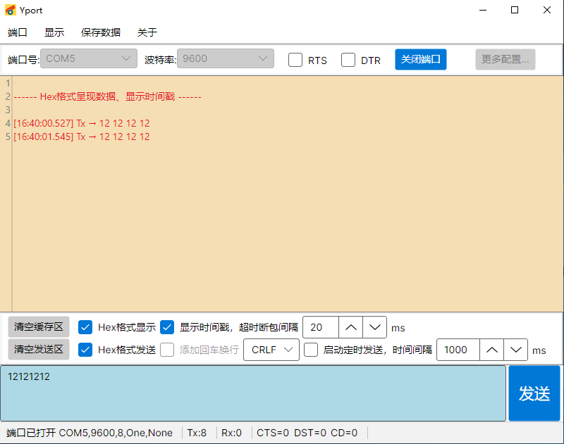

这里是我正在维护或已经完成的一些项目。

它们大多源于真实需求，而不是为了“展示技术”。

---

## 🛠 Yport

**一个面向工程现场的跨平台设备通信调试工具**

## 核心特性 
- 跨平台支持：Windows / Linux(含国产操作系统、Raspberry Pi等) / macOS  
- 绿色可执行：单文件分发，拷贝即用，双击运行 
- 无运行时依赖：无需安装 .NET、JRE 或任何插件 
- 基础串口调试：收发数据、ASCII / Hex 显示 
- 面向工程现场：适合长时间运行与实际设备调试
	
## 为什么要做 Yport？ 
在实际工程中，我们经常遇到这样的情况： 
- 开发环境在 Windows，但设备部署在 Linux 
- 设备运行在 ARM 板卡或树莓派上 
- 不同平台上的串口工具行为和使用体验不一致  
 
此外，在国内工程现场，大量设备运行在国产操作系统之上。 
虽然系统内核基于 Linux，但用户的使用习惯更接近 Windows： 更习惯于双击运行程序，而不是频繁使用命令行。 

Yport 的一个重要设计目标是：  
 
**作为一个“绿色”的工程工具，拷贝即用，双击运行，无需额外依赖。**   

它在不同系统和设备上，提供尽可能一致、低门槛的使用体验。	

## 项目定位 
Yport 是一个面向工程现场的实用型工具，  
目标是提供稳定、低门槛、跨平台一致的调试体验。   
它并不追求覆盖所有通信协议或复杂自动化场景，   
而是专注于解决真实调试过程中反复出现的基础问题。
	
## 主界面

	
## 已验证平台 
Yport 已在以下平台完成实际运行与功能验证：   
- Windows （ARM 架构 和 X64架构） 
- Raspberry Pi（Linux） 
- 银河麒麟操作系统 （ARM 架构 和 X64架构）  

其他平台（如 macOS）在设计上具备支持条件， 但目前尚未进行完整验证。

## 发布与维护策略 
Yport 以长期维护为目标，   
在保持工具稳定与轻量的前提下，   
逐步扩展实用功能。   
后续计划包括但不限于：   
- 更多常用校验算法支持   
- 组合与循环发送能力   
- 常见通信协议的基础解析  
 
功能扩展将优先围绕工程现场的实际需求， 避免引入过度复杂的配置或依赖。	
	
## 下载地址

Yport-win-x64  
链接：https://pan.baidu.com/s/1iu4e27XGR8f0xzbpXSdz3g   
提取码：n0yr  

Yport-win-arm64  
链接：https://pan.baidu.com/s/1F5FHLf45pFeeLy8d4h1UvQ   
提取码：e1er  

linux-x64  
链接：https://pan.baidu.com/s/1-nRFO-F2-Y0OsUv07KJpBw   
提取码：vtsq  

linux-arm64  
链接：https://pan.baidu.com/s/1xwabOzLKhpgixaXhecX9TQ   
提取码：skno 	  

👉 [常见问题](/projects/Yport/)

